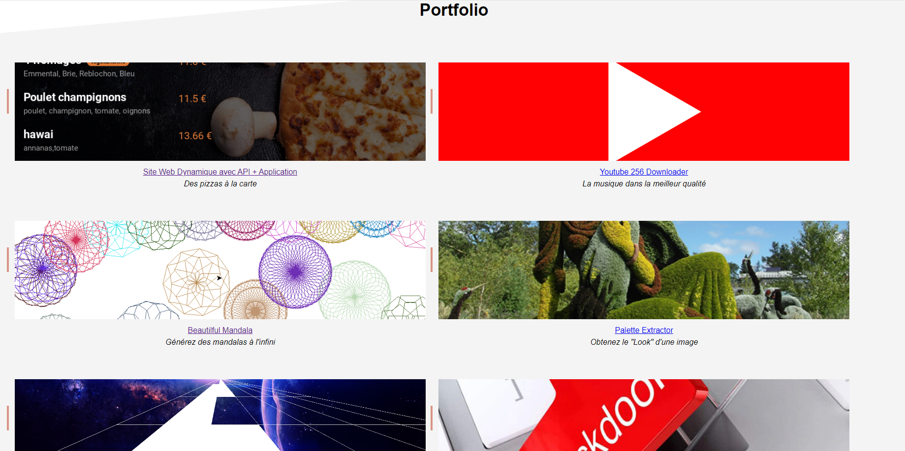

Enthousiaste et passionné par le monde de la programmation,
j'ai fait de ma passion mon métier en devenant un développeur professionnel.

Ma spécialité ? La création de solutions innovantes dans les domaines du web et des applications mobiles.

Fort de mon expertise technique et de mon expérience,
je mets mes compétences au service de projets variés et stimulants.

Que ce soit pour la conception d'un site web dynamique,
le développement d'une application mobile intuitive ou
la création d'une interface utilisateur conviviale,
je suis là pour relever tous les défis.

Flexible et ouvert aux opportunités, je suis disponible pour
des missions freelance, des projets à long terme en entreprise ou
même des programmes d'alternance enrichissants.

Mon objectif ? Contribuer au succès de chaque projet en
apportant mon expertise et ma créativité.

Si vous recherchez un développeur passionné et polyvalent pour concrétiser vos idées,
n'hésitez pas à me contacter.

Ensemble, faisons de vos projets une réalité innovante et performante
