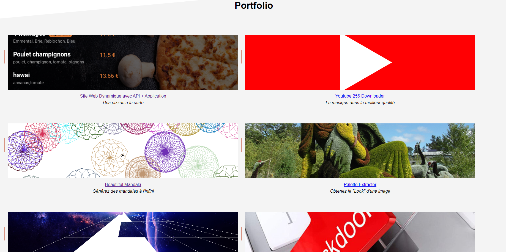

# 📂 My First Portfolio (Archives 2022)

> **⚠️ Note:** This repository contains the code for my very first portfolio, created in **late 2022**. It is a training project that marks my beginnings in development and showcases my skills at that time.

## 👨‍💻 About Me

Enthusiastic and passionate about the world of programming, I turned my passion into my profession by becoming a professional developer.

## 🚀 My Specialties

My specialty? Creating innovative solutions in the fields of web and mobile applications.

With my technical expertise and experience, I put my skills to work on varied and stimulating projects.

## 🛠️ What I Offer

Whether it is for:

- 🌐 Designing a **dynamic website**.
- 📱 Developing an **intuitive mobile application**.
- 🎨 Creating a **user-friendly interface**.

I am here to take on any challenge!

## 💼 Availability

Flexible and open to opportunities, I am available for:

- **Freelance** missions.
- **Long-term** corporate projects.
- Enriching **work-study** (alternance) programs.

## 🎯 Goal

My goal? To contribute to the success of each project by bringing my expertise and creativity.

## 🤝 Contact

If you are looking for a passionate and versatile developer to bring your ideas to life, do not hesitate to contact me.

✨ **Together, let's make your projects an innovative and high-performing reality.**
